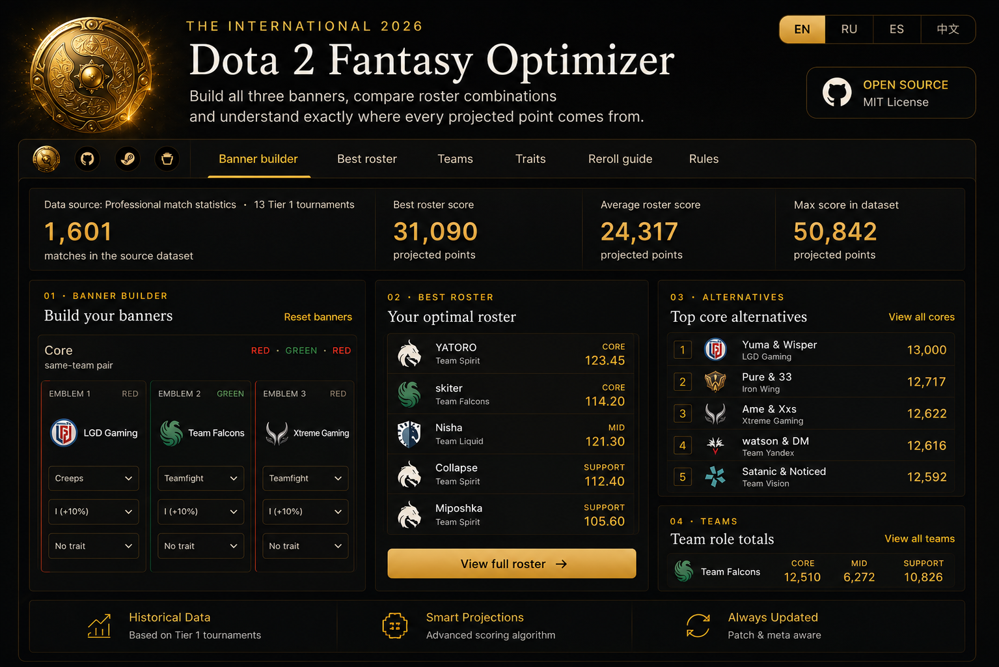

<div align="center">

# 🛡️ Dota 2 Fantasy Calculator 2026

Build and compare Core, Mid and Support banners for **The International 2026** fantasy game, using two switchable data sources: a community-derived dataset and your own collected match data.

[](https://github.com/thetwilightkid/dota2fantasy-calculator/stargazers)

**English · Русский · Desktop / Mobile**

</div>

<p align="center">
  
</p>

---

## About this project

This is a fork of [Kadadji1/dota2-fantasy-optimizer-2026](https://github.com/Kadadji1/dota2-fantasy-optimizer-2026), extended with a second, independently-collected dataset ("My Dataset") and a substantial set of new features built around it — see below. All credit for the original calculator, banner-scoring model and UI foundation goes to Kadadji.

---

## What it does

Helps Dota 2 players compare Fantasy banner configurations and find the strongest projected roster for TI2026, using either the original community dataset or your own collected match data.

### Main features

- **Dual dataset support** — switch between the community dataset and your own collected dataset ("My Dataset") anywhere in the app; every calculation (scores, title odds, team stats) recomputes for whichever is active.
- **Banner Builder** — configure all three emblems for Core, Mid and Support, in either:
  - **Advanced mode** — pick a Tier (I–V) and Trait (Fractal, Benevolent, Vampiric, Unique, Friendly) per emblem, or
  - **Simple mode** — type a direct total percentage per emblem (100 = unmodified base) if you just want to test a specific value without the Tier/Trait system.
- **×1 / ×2 game multiplier** — project a single game or a two-game match.
- **Best Roster** — instantly compare the strongest projected player combinations; pin any alternative pick as your actual choice ("Choose") and every downstream number (total score, recommended Prefix/Subtitle) recomputes around it, while still being able to inspect other alternatives' detail at the same time.
- **Prefix & Subtitle recommendation engine** — computes the expected value of every Prefix and (where the data supports it) every Subtitle for your current roster and suggests the best one, instead of just showing flat bonus percentages.
- **Team Overview** — represented TI2026 teams, per-role picks, matches recorded, team-wide Suffix trigger chances, and each team's most-played hero colors.
- **Stat Leaderboard** — rank every Core/Mid/Support pick by any single tracked stat, with a standalone "what if this stat were worth X%" multiplier.
- **Traits Guide, Reroll Guide, Scoring Reference** — reference material for how banner properties, tiers and stat weights affect the final score.
- **Two interface languages** — English and Russian.
- Responsive layout for desktop, tablet and mobile.

---

## How to use it

1. Pick which dataset you want to use (top of the page).
2. Choose the statistics shown on your three emblems, in Simple or Advanced mode.
3. Open **Best Roster** to see the highest projected lineup, or pin your own picks from the alternatives list.
4. Pick a Prefix and Subtitle, or use the recommended one for your current roster.
5. Check the **Teams** and **Stat Leaderboard** sections to compare raw player/team data directly.

---

## Data and methodology

Two datasets are available, switchable at any time:

- **Community dataset** — professional Tier 1 match statistics collected across 13 tournaments, pre-compressed into per-player/pair Fantasy values.
- **My Dataset** — an independently collected dataset (27 tournaments, 2,796+ matches) covering the same 16 teams / 80 players, generated from raw per-game data via `scripts/build-mine-dataset.js`. This dataset additionally exposes per-player title probabilities (shrinkage-adjusted), team-wide Subtitle trigger rates, and min/max/median ranges per stat, which power the recommendation engine and Stat Leaderboard.

Full methodology notes (including known approximations and what each dataset can/can't compute) are shown directly on the site's Rules section.

---

## Technology

- Next.js
- React
- TypeScript
- Vercel Analytics

---

## Local development

```bash
npm install
npm run dev
```

Then open `http://localhost:3000`.

### Using your own dataset

This repo ships with the generated output of "My Dataset" (`data/mine/*.ts`), so the app runs out of the box. To regenerate it from your own raw data, put your collection in a local `data3/` folder (gitignored) matching the shape expected by `scripts/build-mine-dataset.js`, then run:

```bash
node scripts/build-mine-dataset.js
```

---

## License

MIT — see [LICENSE](./LICENSE). The original project this is forked from is credited above; check its own repository for its licensing terms.

---

## Disclaimer

This is an independent fan-made community project and is not affiliated with Valve Corporation.

Dota 2, The International and all related trademarks and assets belong to their respective owners.
